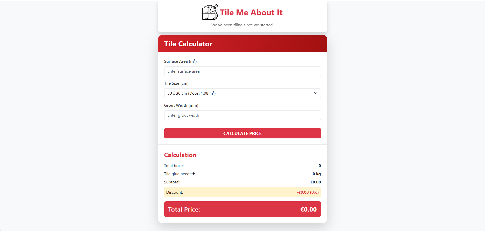

# 🧱 Tile Me About It: A Tiler's Price Calculator

A clean, responsive, single-page utility app designed for tilers to quickly calculate material needs and total cost for a project.

This tool instantly calculates the number of tile boxes, the amount of glue required, and the final price, including a tiered discount system based on the total cost.

### [✨ View the Live Demo Here! ✨](https://am1407.github.io/tiling_tool/)

---

## 📸 Preview

---

## ✨ Core Features

* **Material Calculation:** Automatically calculates the exact number of tile boxes needed, including a 10% waste margin, and the required kilograms of tile glue.
* **Dynamic Price Calculation:** Provides an instant subtotal based on a fixed price per square meter.
* **Tiered Discount System:** This is the core business logic. The app automatically applies a different discount percentage based on the subtotal:
    * **2%** for subtotals over €0
    * **5%** for subtotals over €1,000
    * **10%** for subtotals over €5,000
* **Data-Driven Dropdown:** The "Tile Size" dropdown is not hardcoded in the HTML. It is dynamically populated by JavaScript from a `TILE_DATA` array, making it easy to update and maintain.
* **Input Validation:** The calculator validates that all inputs are valid numbers before performing a calculation, showing an alert if data is missing.
* **Clean UI:** A fully responsive, clean, and custom-styled interface built with Bootstrap.

---

## 🛠️ Technologies Used

* **HTML5:** A single-page, semantic structure.
* **Bootstrap 5:** Used for the responsive layout, card, form controls, and utility classes.
* **CSS3:** Custom styling for the header, calculator theme, colors, and spacing.
* **Vanilla JavaScript (ES6+):** Used for all the application logic, including:
    * DOM manipulation
    * Event handling
    * Dynamic HTML generation (for the dropdown)
    * All calculation and discount logic

---

## 💡 Code Highlights

This project was built using modern JavaScript best practices:

* **`DOMContentLoaded`:** The entire script is wrapped in a `DOMContentLoaded` event listener to ensure all HTML elements are loaded before the script runs, preventing errors.
* **`initializeCalculator` Function:** All setup logic (getting elements, populating the dropdown, and attaching event listeners) is contained in a single `init` function.
* **Data Separation:** Tile data (size, coverage per box) is stored in a `TILE_DATA` constant, separating the data from the application logic.

---

## 🚀 How to Use

No installation is required!

1.  Clone this repository or download the ZIP file.
2.  Open the `index.html` file in any web browser.
3.  Enter the surface area, select a tile size, enter grout width, and click "Calculate Price" to see the results.